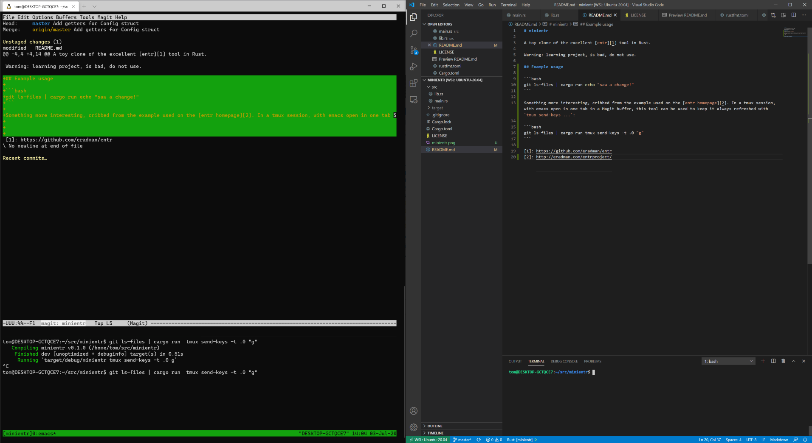

# minientr

A toy clone of the excellent [entr][1] tool in Rust.

Warning: learning project, is bad, do not use.

## Example usage

```bash
git ls-files | cargo run echo "saw a change!"
```

Something more interesting, cribbed from the example used on the [entr homepage][2]. In a tmux session, with emacs open in one tab in a Magit buffer, this tool can be used to keep it always refreshed with `tmux send-keys ...`:

```bash
git ls-files | cargo run tmux send-keys -t .0 "g"
```



[1]: https://github.com/eradman/entr
[2]: http://eradman.com/entrproject/